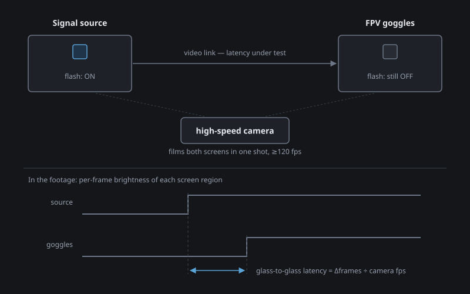
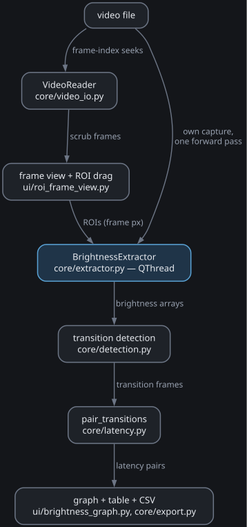

# FPV Latency Tool — Glass-to-Glass Latency Analyzer

Measures glass-to-glass latency by analyzing a video that captures two screens side by side: the original signal source and the delayed display (e.g. FPV goggles). The tool detects light/dark transitions in each screen's region, pairs them, and reports the timing offset.



## Features

- **Video scrubbing** — frame-accurate seek with playhead, in/out point markers, play/pause
- **ROI selection** — click-and-drag rectangles over each screen; live mean-brightness readout updates as you scrub
- **Brightness extraction** — runs in a background thread; progress bar with cancel
- **Derivative-based transition detection** — finds rising and falling edges via per-frame brightness change; configurable min ΔBrightness, min spacing, and max latency window
- **Transition pairing** — greedy nearest-following match; unmatched transitions highlighted red on the graph
- **Results table** — transition #, display frame, output frame, direction, latency in frames and ms; click a row to jump to that frame; CSV export
- **FPS verification** — measure the test pattern's periodicity and cross-check against the known period to compute the true frame rate
- **CLI parameters** — pre-fill any setting from the command line for reproducible runs; "Show CLI Options" dialog copies the full command

> **Detection limitation:** transitions are found where a *single*
> frame-to-frame brightness step exceeds the Min ΔBrightness threshold. A slow
> fade spread over several frames (e.g. LCD pixel response) can be missed even
> though the total change is large — lower the threshold or use a test pattern
> with a hard edge. See DESIGN.md for details.

## Download

Prebuilt binaries (Windows exe, Linux, macOS) are produced by the CI workflow:
grab them from the *Actions* tab of any run, or from *Releases* for tagged
versions. See [BUILDING.md](BUILDING.md) to build one yourself.

## Running from source

Install [uv](https://docs.astral.sh/uv/getting-started/installation/), then:

```bash
uv sync
uv run main.py
```

(Works the same on Windows, Linux, and macOS. Plain pip also works:
`pip install .` then `python main.py`.)

Run the tests with:

```bash
uv run pytest
```

## Recording good footage

The measurement is only as good as the clip. What works:

**Test pattern.** A full-screen, hard-edged black↔white flash with a known
period — 1 Hz is a good default. Enter that period in the *Known period* field
and the tool cross-checks your camera's real frame rate. Record 10+ flash
cycles so the mean/min/max latency is statistics, not a single sample. A hard
edge matters: detection triggers on a single frame-to-frame brightness step,
so a pattern that fades misses (see the note above).

**Camera.** Any phone with a slow-motion mode (120/240 fps) or an action cam
(GoPro: 120/240 fps modes) works. Each frame is `1000 / fps` ms of measurement
resolution — at 30 fps that is a coarse ±33 ms, at 240 fps ±4 ms. Settings
that matter:

- **Lock exposure, focus, and white balance** (tap-and-hold AE/AF lock on
  phones, "lock" in GoPro Protune). Auto-exposure drifts ruin the brightness
  traces.
- Steady the camera — tripod or propped, not handheld.
- Do **not** trust the file's reported fps for slow-motion clips; containers
  frequently store the playback rate, not the capture rate. That is exactly
  what the FPS verification row is for.

**Framing.** Both screens fully visible in one shot, side by side
*horizontally* rather than stacked — rolling-shutter cameras scan the frame
top to bottom, so vertical separation adds a scan-time offset between the two
regions. Film the goggle screen straight through the eyecup lens, focused,
without glare.

**The display you flash on.** Panel response time shapes the transition edge:

| Panel | Suitability | Notes |
|---|---|---|
| OLED | best | near-instant pixel response, clean hard edges |
| fast IPS | good | a few ms response, still a clear step |
| VA | usable | slow response smears the edge over frames — lower *Min ΔBrightness* if transitions go undetected |
| LCD/QLED with local dimming | usable | **disable local dimming** — backlight zones fade slowly and blur the edge |

Set the monitor bright enough that the dark/light states are clearly separated
in the footage, but not so bright the white clips or blooms. Avoid running the
screen very dim: many backlights dim with PWM flicker, which beats against the
camera frame rate and pollutes the brightness trace.

## Usage

```
python main.py [file]
               [--fps FLOAT]
               [--roi-original x,y,w,h]
               [--roi-display  x,y,w,h]
               [--direction    both|rising|falling]
               [--min-delta    INT]
               [--min-spacing  INT]
               [--max-latency  INT]
               [--in-point     INT]
               [--out-point    INT]
```

## Keyboard shortcuts

| Key | Action |
|-----|--------|
| Left / Right | Step one frame |
| Up / Down | Previous / next transition |
| PgUp / PgDn | Jump ~1 second |
| Space | Play / pause |
| I / O | Set in / out point at playhead |
| Home / End | Jump to in / out point |
| Ctrl+Z | Undo last ROI change |
| F1 / ? | Show this help |

## Project layout

```
fpv-latency-tool/
├── main.py                   # entry point
├── pyproject.toml            # dependencies (managed with uv)
├── main.spec                 # PyInstaller build spec (see BUILDING.md)
├── DESIGN.md                 # architecture reference
├── core/
│   ├── detection.py          # derivative-based transition detection
│   ├── export.py             # CSV export
│   ├── extractor.py          # QThread brightness extraction worker
│   ├── latency.py            # LatencyPair dataclass + pairing algorithm
│   ├── roi.py                # ROI dataclass: pixel coords + mean_brightness()
│   └── video_io.py           # VideoReader: frame-accurate seeking, metadata
├── ui/
│   ├── brightness_graph.py   # pyqtgraph brightness traces + transition markers
│   ├── main_window.py        # main window: controls, layout, wiring
│   ├── roi_frame_view.py     # click-drag ROI overlay on the video frame
│   └── timeline.py           # playhead + in/out handle widget
└── tests/                    # pytest suite (runs headless, see conftest.py)
```

Data flow through the modules (see [DESIGN.md](DESIGN.md) for the full picture):


